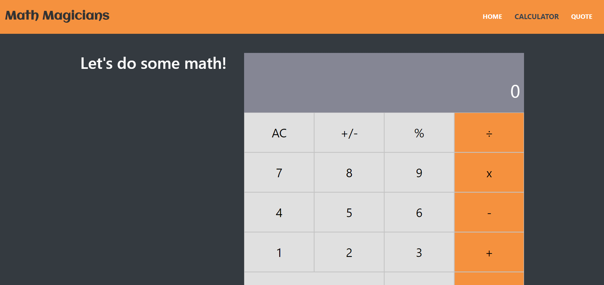

# Math Magicians


## Description

> Math magicians is a single page web app that was built with React.js and Bootstrap. React-Router was used to provide all of the navigation and view-loading goodness.

## Library Directory 📙

| Contents                    |
| --------------------------- |
| [Live Demo](#live-demo)     |
| [Screenshots](#screenshots) |
| [Built With](#built-with-🛠) |
| [Setup](#setup-⏳)          |
| [Testing](#testing-⚙️)      |
| [Authors](#authors)         |
| [License](#license)         |

## Live Demo

[Live demo](https://react-math-magicians.herokuapp.com/)

## Screenshots



## Built With 🛠

```
- React.js
- Node.js
- ES6
- Bootstrap
- HTML
- CSS
```

## Setup ⏳

> Follow these steps to setup this web application locally :

1. - [ ] Open your `Terminal`.
2. - [ ] Navigate to the directory where you will like to install the repo by running `cd FOLDER-NAME`
3. - [ ] Run `git clone git@github.com:khalilhamdii/react_math_magicians.git` in the terminal to download.
4. - [ ] Run `cd react_math_magicians` to enter directory.
5. - [ ] Run `npm install` to install node packages and dependencies.
6. - [ ] Run `npm start` in your browser to start the application.

## Testing ⚙️

> I used [Jest](https://jestjs.io/) testing tool and react testing library to test functions by creating several test cases and snapshots. Please follow below steps to run Jest testing tool:

1. - [ ] Open `Terminal` again
2. - [ ] Run `cd react_math_magicians` to enter directory
3. - [ ] Run `npm test` to start testing
4. - [ ] All tests will pass ✅

## Authors

### 👨‍💻 Khalil Hamdi

[](https://github.com/khalilhamdii) <br>
[](https://www.linkedin.com/in/khalilhamdi/) <br>
[](mailto:khaalil.hamdi@gmail.com) <br>
[](https://twitter.com/Khalilhamdiii)

### 🤝 Contributing

Contributions, issues and feature requests are welcome!

Feel free to check the [issues page](https://github.com/khalilhamdii/MyTodos).

### Show your support

Give a ⭐️ if you like this project!

### License


